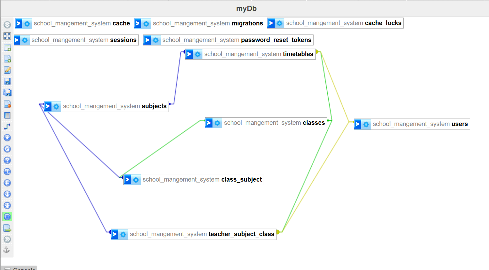

## Database Schema Design

I designed a comprehensive database schema to efficiently manage educational data. The schema includes the following key tables:

- **`classes`**: Contains details about each class, with columns for `id`, `name`, and `grade`.
- **`timetable`**: Handles scheduling for classes, featuring columns for `class_id`, `teacher_id`, `subject_id`, `start_time`, `end_time`, and `day_of_week`.
- **`teacher_subject_class`**: A pivot table linking teachers, subjects, and classes, including a `weekly_sessions` column to specify the number of sessions per week.
- **`class_subject`**: Another pivot table that manages the many-to-many relationship between classes and subjects, with a `required_sessions` column to indicate the number of sessions required.

Additionally, the `users` table includes an `is_admin` flag, which is a boolean field that determines whether a user has administrative privileges, defaulting to `false` for regular users.

Each table is equipped with foreign key constraints to maintain data integrity and ensure proper relationships between entities.

## Authentication

The authentication mechanism is implemented using Laravel Breeze. During the user creation process, the `is_admin` flag is set to `0` by default, initializing new users as teachers with standard user privileges. This setup ensures that users are correctly categorized and can be granted administrative rights as needed.
