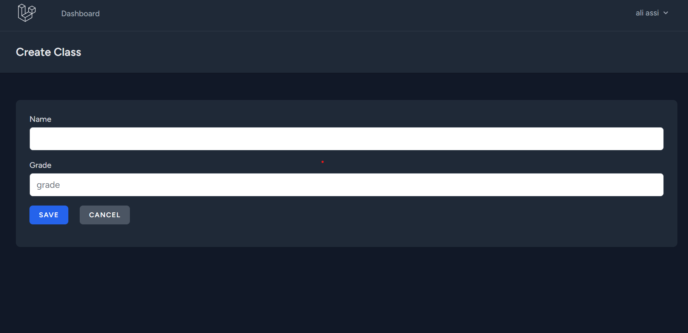

---

## Database Schema Design

I have designed a comprehensive and efficient database schema to manage educational data. The schema includes the following key tables:

- **`classes`**: Stores details about each class. Key columns:
  - `id`: Unique identifier for each class.
  - `name`: Name of the class.
  - `grade`: Grade level associated with the class.

- **`timetable`**: Manages class scheduling. Key columns:
  - `class_id`: Foreign key linking to the `classes` table.
  - `teacher_id`: Foreign key linking to the `users` table (representing teachers).
  - `subject_id`: Foreign key linking to the `subjects` table.
  - `start_time`: Time the class starts.
  - `end_time`: Time the class ends.
  - `day_of_week`: Day when the class occurs.

- **`teacher_subject_class`**: A pivot table linking teachers, subjects, and classes. Key columns:
  - `class_id`: Foreign key linking to the `classes` table.
  - `user_id`: Foreign key linking to the `users` table.
  - `subject_id`: Foreign key linking to the `subjects` table.
  - `weekly_sessions`: Number of sessions per week for the subject in the class.

- **`class_subject`**: A pivot table managing the many-to-many relationship between classes and subjects. Key columns:
  - `class_id`: Foreign key linking to the `classes` table.
  - `subject_id`: Foreign key linking to the `subjects` table.
  - `required_sessions`: Number of sessions required for the subject in the class.

The `users` table includes an `is_admin` flag, a boolean field that determines whether a user has administrative privileges. By default, this flag is set to `false` for regular users.

Foreign key constraints are applied to maintain data integrity and ensure proper relationships between tables.

## Authentication

The authentication mechanism is implemented using Laravel Breeze. During user creation, the `is_admin` flag is set to `0` by default, initializing new users as teachers with standard privileges. This setup allows for easy elevation of user privileges to administrative roles as needed.

## User Interface Design

The application is styled using Tailwind CSS for a modern and responsive design. Key components include:

### Dashboard

### Classes CRUD Interfaces

- **View Page**:  
  

- **Create Page**:  
  

- **Update Page**:  
  

### Subjects CRUD Interfaces

- **View Page**:  
  

- **Create Page**:  
  

- **Update Page**:  
  

### Teachers CRUD Interfaces

- **View Page**:  
  

- **Create Page**:  
  

- **Update Page**:  
  
---

