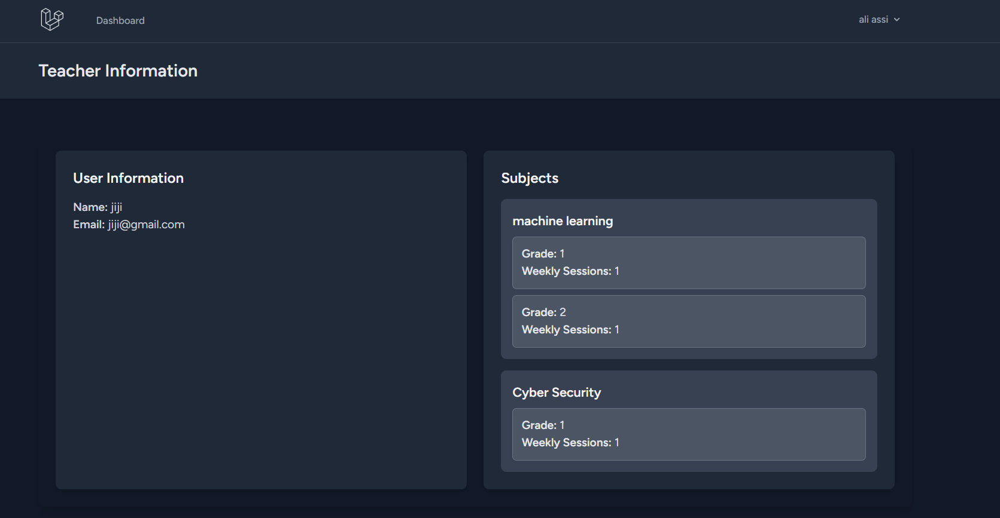
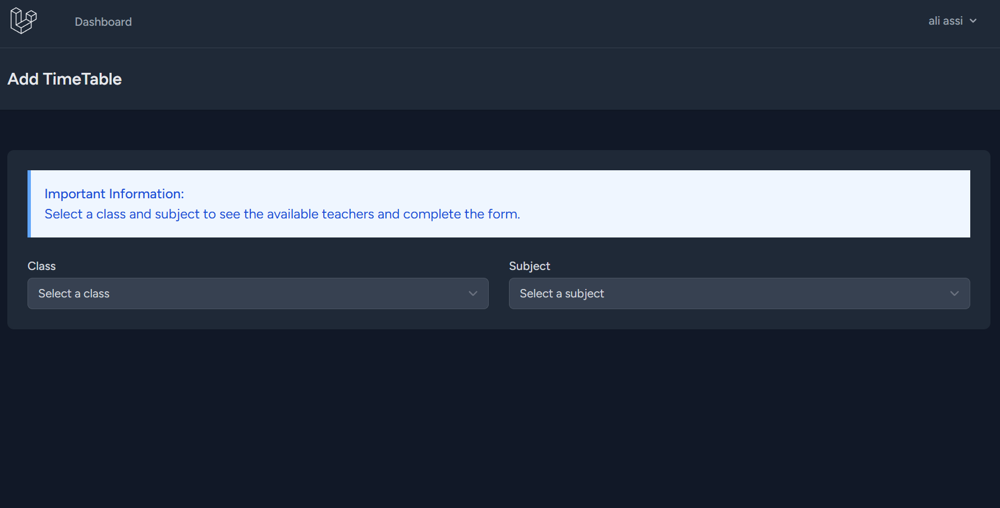

---

# Day 1 Report

## Database Schema Design

The database schema is crafted to efficiently manage educational data, featuring the following primary tables:

### **Classes Table**
- **`id`**: Unique identifier for the class.
- **`name`**: Name of the class.
- **`grade`**: Associated grade level.

### **Timetable Table**
- **`class_id`**: Foreign key referencing the `classes` table.
- **`teacher_id`**: Foreign key referencing the `users` table (teachers).
- **`subject_id`**: Foreign key referencing the `subjects` table.
- **`start_time`**: Start time of the class.
- **`end_time`**: End time of the class.
- **`day_of_week`**: Day on which the class is scheduled.

### **Teacher_Subject_Class Pivot Table**
- **`class_id`**: Foreign key referencing the `classes` table.
- **`user_id`**: Foreign key referencing the `users` table.
- **`subject_id`**: Foreign key referencing the `subjects` table.
- **`weekly_sessions`**: Number of weekly sessions for the subject in the class.

### **Class_Subject Pivot Table**
- **`class_id`**: Foreign key referencing the `classes` table.
- **`subject_id`**: Foreign key referencing the `subjects` table.
- **`required_sessions`**: Number of sessions required for the subject in the class.

The `users` table includes an `is_admin` flag to determine administrative privileges, set to `0` by default for regular users. Foreign key constraints are employed to ensure data integrity.

## Authentication

Authentication is managed via Laravel Breeze. New users are initialized as teachers with the `is_admin` flag set to `0` by default. Administrative privileges can be granted as needed.

## User Interface Design

The application features a modern, responsive design powered by Tailwind CSS. Key components include:

### **Dashboard**

### **Classes CRUD Interfaces**

- **View Page**:  
    
  Pagination is implemented for efficient data management.

- **Create Page**:  
  

- **Update Page**:  
  

### **Subjects CRUD Interfaces**

- **View Page**:  
    
  Pagination streamlines subject data display.

- **Show Page**:  
  

- **Create Page**:  
  

- **Update Page**:  
  

### **Teachers CRUD Interfaces**

- **View Page**:  
    
  Pagination ensures effective presentation of teacher records.

- **Show Page**:  
  

- **Create Page**:  
  

- **Update Page**:  
  

**Note**: Timetable management features are still under development.

---

# Day 2 Report

### **Timetables CRUD Interfaces**

- **View Page**:  
  This dynamic page displays timetables for a specific class or all classes.
  

- **Create Page**:  
  Dynamic form approach for creating timetables.
  **Part 1**  
    
  **After Selecting Information**  
  

- **Update Page**:  
  

- **Update Page (Alternative)**:  
  

### **Automatic Timetables Generation Interface**

- **View Page**:  
  

- **Error Display Page**:  
    
  Displayed when auto-generation is not possible.

### **Export Classes Timetables to PDF**

- **Export Button**:  
    
  Includes a button for exporting class schedules to PDF.

- **PDF Result**:  
    
  Generated using the `barryvdh/laravel-dompdf` library.

### **Allow Teachers to See Only Their Timetables**

- **Dashboard**:  
  

**Note**: An algorithm currently handles timetable scheduling respecting constraints. Future versions may include an AI-based approach for enhanced scheduling.

---

